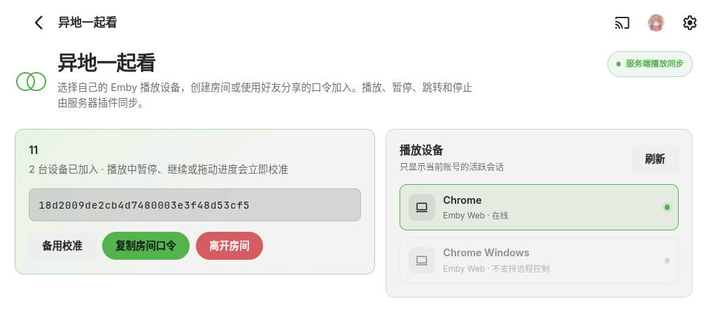

# Sync Together for Emby

<p align="center">
  <strong>在 Emby 原生界面中创建同步观影房间。</strong><br>
  单个服务端 DLL，无独立后端、无媒体代理、无浏览器扩展。
</p>

<p align="center">
  
  
  
  <a href="LICENSE"></a>
</p>


## 项目简介

Emby 4.9.x 内置的 Party API 只负责保存房间成员关系，本身不会转发播放状态。Sync Together 在此基础上增加服务端播放中继，让不同账号、不同地点的 Emby 客户端保持相同的影片、进度和暂停状态。

插件页面直接注册到 Emby 的左侧菜单和用户菜单；页面、样式、脚本及同步引擎全部封装在 `SyncTogether.dll` 中。

## 功能

- 原生 Emby 房间管理页面
- 创建房间、复制口令、跨账号加入和离开
- 自动识别当前账号的可控播放设备
- 同步播放、暂停、继续、跳转和停止
- 切换剧集或影片时自动跟随
- 播放器内校准：暂停、继续或拖动进度条时立即校准其他设备
- 自动漂移修正：
  - 小于 `800 ms`：忽略，避免频繁跳动
  - `800 ms～2 s`：连续两次出现后修正
  - 大于 `2 s`：立即修正
- 房间页提供“立即校准”入口，双向可用：所选设备在播放时作为基准，未播放时追上房间进度
- 单 DLL 安装，不创建额外容器、端口或数据库

## 界面预览



房间成员、共享口令、备用校准和当前账号的可控播放设备集中显示在 Emby 原生页面中。

## 工作方式

```text
Emby 客户端 A ──播放事件──┐
                          │
                    SyncTogether.dll
                          │
Emby 客户端 B ◀─远程命令──┘
```

插件监听 Emby 的播放事件，以最近主动操作的房间成员作为同步基准，通过 Emby 已有的远程控制通道向其他成员发送命令。媒体文件仍由各客户端直接从原 Emby Server 播放，插件不转发视频流。

## 兼容性

| 项目 | 状态 |
| --- | --- |
| Emby Server `4.9.3.0` | 已验证 |
| Emby Server `4.9.x` | 设计目标，其他小版本有待验证 |
| Emby Web | 已验证 |
| 支持 Emby 远程控制的客户端 | 可加入房间 |
| 不支持远程控制的会话 | 页面显示，但不可选择 |

## 安装

### 使用发布版

1. 从 GitHub Releases 下载 `SyncTogether.dll`。
2. 将其复制到 Emby 插件目录：

   ```text
   /config/plugins/SyncTogether.dll
   ```

3. 重启 Emby Server。
4. 刷新 Emby Web，在左侧菜单或用户菜单中打开 **异地一起看**。

Docker 或 NAS 环境中，请将 DLL 放入映射到容器 `/config/plugins` 的宿主机目录。

### 使用方法

1. 两个账号分别打开 Emby 客户端。
2. 房主打开 **异地一起看**，选择自己的在线设备并创建房间。
3. 将房间口令发送给另一位用户。
4. 对方选择自己的设备并粘贴口令加入。
5. 任意一方开始播放；最近主动播放、暂停、继续或拖动进度的一方会成为同步基准。

房间关系保存在 Emby 进程内存中，因此重启 Emby 后需要重新创建和加入房间。

## 项目结构

```text
.
├── docs/assets/                  # README 宣传资源
├── src/SyncTogether.Plugin/
│   ├── Web/                      # 嵌入 DLL 的原生页面与控制器
│   ├── Contracts.cs              # 插件 HTTP API
│   ├── PartyPlaybackSynchronizer.cs
│   ├── Plugin.cs
│   └── SyncTogetherService.cs
├── Directory.Build.props
└── README.md
```

## 隐私与安全

- 所有插件 API 均要求已登录的 Emby 用户。
- 用户只能选择和管理属于自己的播放会话。
- 房间状态不会通过状态接口向无关用户公开。
- 插件不上传媒体、账号凭据或播放记录到第三方服务。

## 开源许可

本项目采用 [MIT License](LICENSE)。Emby 及其服务端程序集归其各自权利人所有，不包含在本项目许可范围内。
